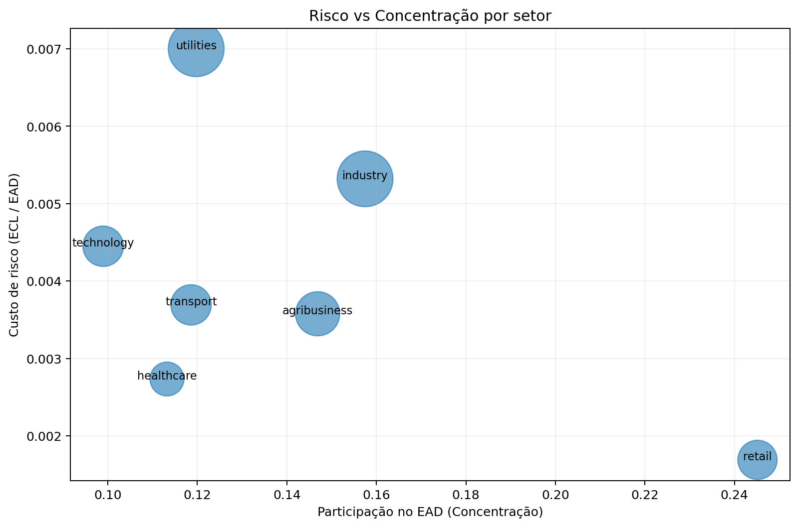
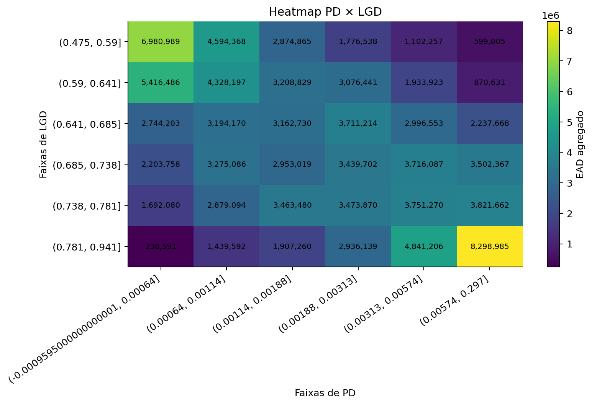
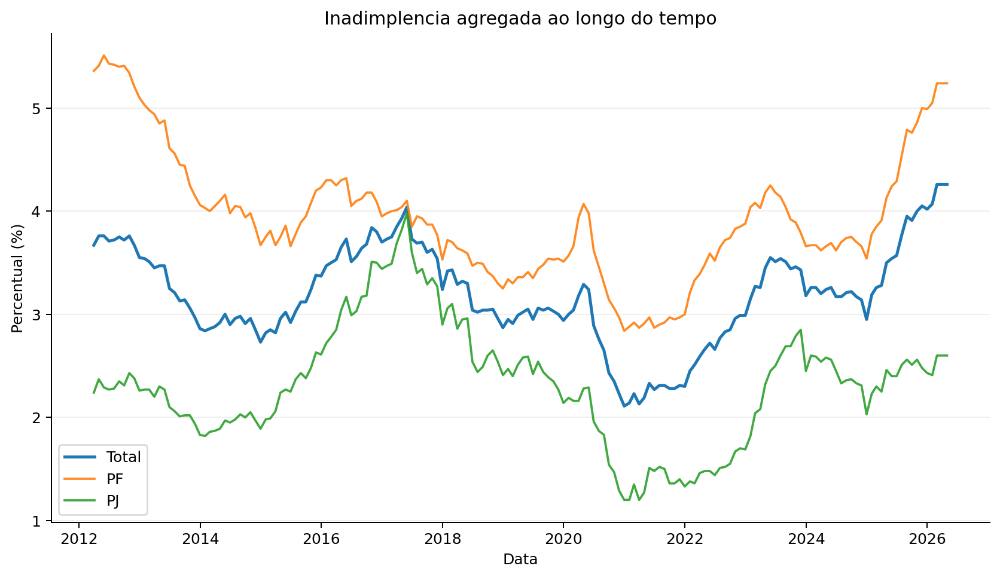

# Motor de Risco de Crédito e Gestão de Portfólio 🏦📊

> **ECL, Modelagem IRB, Alocação Setorial e Estratégia de Originação**
> Motor de risco de crédito com integração macroeconômica real e foco em decisão de portfólio.

## Visão Geral

Este projeto implementa um motor integrado de risco de crédito com cálculo de ECL (12 meses e lifetime), stress testing macroeconômico e uma camada avançada de análise de portfólio voltada à decisão de originação e alocação de capital.

A arquitetura combina:

- **Modelagem de risco individual** (PD, LGD, EAD)
- **Cálculo de perdas esperadas (ECL)**
- **Cenários forward-looking**
- **Gestão de portfólio e concentração**
- **Integração com dados macroeconômicos reais do Brasil**
- **Camada de validação macro baseada em dados agregados do sistema de crédito**

O projeto opera em dois modos:

- **Modo sintético (fallback)**: garante reprodutibilidade e controle total do pipeline
- **Modo com dados reais**: utiliza fatores macroeconômicos provenientes de IPEA, SIDRA/IBGE e Banco Central

Essa abordagem permite conciliar **controle experimental com aderência econômica real**, aproximando o modelo da dinâmica observada no sistema financeiro.

## Objetivo do Projeto

Construir um sistema integrado que permita:

- **Estimar risco de crédito** no nível individual (PD, LGD, EAD).
- **Calcular perdas esperadas** (ECL - Expected Credit Loss).
- **Incorporar visão forward-looking** via cenários macroeconômicos.
- **Modelar a dinâmica de risco** ao longo do tempo (lifetime).
- **Analisar concentração** e estrutura da carteira.
- **Identificar oportunidades** de diversificação (hedge natural).
- **Apoiar decisões** de originação e precificação.

---

## Arquitetura do Projeto

A estrutura de diretórios foi desenhada para manter a modularidade e facilitar a manutenção dos diferentes componentes do motor de risco.

```text
risk_4966_irb_project/
│
├── main.py
├── config.py
├── requirements.txt
│
├── data/
│   └── outputs/
│
├── src/
│   ├── data_sources/
│   │   ├── ipea_client.py
│   │   ├── sidra_client.py
│   │   └── bcb_client.py
│   │
│   ├── macro_feature_store.py
│   ├── macro_mapping.py
│   ├── macro_credit_analytics.py
│   │
│   ├── data_generation.py
│   ├── feature_engineering.py
│   ├── pd_model.py
│   ├── lgd_model.py
│   ├── ead_model.py
│   ├── staging.py
│   ├── ecl_engine.py
│   ├── stress_testing.py
│   ├── validation.py
│   ├── sector_risk.py
│   ├── portfolio_policy.py
│   └── reporting.py
│
└── notebooks/
    └── exploration.ipynb
```

---

## Camada de Dados (Macro Real)

O projeto incorpora uma camada dedicada de ingestão e processamento de dados macroeconômicos reais do Brasil.

### Fontes Integradas

- **Banco Central (BCData/SGS):**
  - Taxa Selic
  - Inadimplência agregada (total, PF e PJ)
  - Saldo de crédito
  - Spread de crédito

- **SIDRA / IBGE:**
  - Taxa de desemprego
  - Indicadores de atividade

- **IPEA:**
  - Proxy mensal de atividade econômica (PIB mensal)

Essa camada permite que o modelo deixe de depender exclusivamente de premissas sintéticas, passando a refletir, ainda que de forma agregada, a dinâmica real do ciclo de crédito brasileiro.

### Feature Store

Os dados são consolidados em:

- `macro_factors_raw.csv` (formato longo)
- `macro_factors_wide.csv` (formato model-ready)

A camada de **feature store** permite:

- harmonização temporal (mensal)
- padronização de séries
- fallback automático
- integração opcional ao motor de risco

### Integração com o Motor

O motor pode operar com:

- fatores macro sintéticos (modo padrão)
- fatores macro reais (modo configurável)

Essa integração é controlada via `config.py`, com fallback automático em caso de falha.

## Componentes Principais

### 1. Modelagem de Risco de Crédito

A base do cálculo de perdas esperadas é formada pelos três pilares clássicos de risco:

- **PD (Probabilidade de Inadimplência):** Utiliza regressão logística considerando variáveis comportamentais e macroeconômicas. A saída é a PD de 12 meses.
- **LGD (Loss Given Default):** Modelo baseado em árvores de decisão. Considera o valor do colateral, o tipo de produto e o perfil do cliente.
- **EAD (Exposure at Default):** Inclui o saldo devedor atual mais a exposição não sacada (aplicando o CCF - Credit Conversion Factor), capturando a dinâmica de utilização das linhas de crédito.

### 2. Perda Esperada (ECL)

O motor calcula a Perda Esperada de Crédito (ECL) considerando o horizonte de tempo apropriado para cada operação:

- **Stage 1:** ECL de 12 meses.
- **Stage 2 e 3:** ECL ao longo da vida (lifetime).

A fórmula base utilizada é:

$$ECL = PD \times LGD \times EAD \text{ (ajustada a valor presente)}$$

O cálculo inclui o desconto financeiro, a aproximação via *hazard rate* e a agregação mensal de default marginal.

Este framework segue a lógica esperada para modelos de perda esperada sob IFRS 9 / CMN 4.966:

- Separação entre **Stage 1 (12m ECL)** e **Stage 2/3 (Lifetime ECL)**.
- Incorporação de **forward-looking information** via cenários macroeconômicos.
- Modelagem independente de **PD, LGD e EAD**.
- Avaliação dinâmica de deterioração de risco (SICR).

Embora simplificado, o modelo reflete a estrutura conceitual utilizada em instituições financeiras.

### 3. Classificação por Estágios (4.966 / IFRS 9)

O enquadramento das operações segue as diretrizes regulatórias de *staging*:

- **Stage 1:** Risco estável.
- **Stage 2:** Aumento significativo do risco (SICR).
- **Stage 3:** Inadimplência (Default).

Os critérios para transição de estágio incluem os dias de atraso (DPD) e o aumento relativo da PD desde a originação.

### 4. Forward-Looking e Cenários

A modelagem incorpora expectativas macroeconômicas para projetar o risco futuro, utilizando variáveis como **desemprego**, **taxa de juros (proxy)** e **crescimento do PIB**.

O sistema avalia três cenários distintos:
1. Base
2. Adverso
3. Severo

Para cada cenário, o motor recalcula os parâmetros de risco (PD, LGD, EAD), a distribuição de estágios da carteira e a ECL total.

### 5. Validação dos Modelos

Garante a robustez e confiabilidade das estimativas através de métricas consagradas:

| Métrica | Propósito |
| :--- | :--- |
| **AUC** | Avalia o poder de discriminação do modelo. |
| **Brier Score** | Mede a precisão (calibração) das probabilidades estimadas. |
| **Tabela de Calibração** | Compara a taxa de default observada com a PD estimada. |
| **PSI** | Population Stability Index para medir a estabilidade populacional ao longo do tempo. |

Isso permite o monitoramento contínuo de performance, detecção de *concept drift* e análise geral de robustez.

---

## Camada de Portfólio (Diferencial do Projeto)

Além da visão individualizada por contrato, o projeto se destaca por sua robusta camada de gestão de portfólio.

### 6. Análise Setorial

Para cada setor econômico presente na carteira, o sistema consolida:

- EAD e ECL totais.
- PD e LGD médias.
- Participação percentual na carteira.
- Custo de risco.

Também é calculado o **HHI (Herfindahl-Hirschman Index)** para monitorar e quantificar a concentração do portfólio.

### 7. Correlação entre Setores

O modelo constrói séries temporais de risco por setor e gera uma **matriz de correlação**. Isso permite identificar setores que se movem de forma conjunta (pró-cíclicos), setores descorrelacionados e potenciais oportunidades de diversificação.

### 8. Hedge "Natural" (Diversificação Estrutural)

Setores com correlação baixa ou negativa são identificados automaticamente como candidatos a **hedge natural** na composição da carteira. Vale ressaltar que este não é um hedge realizado com instrumentos derivativos, mas sim um hedge via diversificação inteligente da exposição de crédito.

---

## Índice de Atratividade Setorial

### Objetivo
Avaliar de forma sistemática quais setores são mais interessantes para direcionar novas originações de crédito.

### Componentes e Impacto

O índice combina diferentes fatores para gerar um score consolidado. A fórmula conceitual considera:

| Fator | Impacto na Atratividade |
| :--- | :--- |
| **Spread** | Positivo (+) |
| **PD** | Negativo (-) |
| **LGD** | Negativo (-) |
| **Concentração** | Negativo (-) |
| **Correlação com a carteira** | Negativo (-) |

### Saída e Interpretação Estratégica

Cada setor recebe um score de atratividade, uma posição no ranking e uma classificação estratégica que guia a atuação comercial:

| Categoria Estratégica | Interpretação |
| :--- | :--- |
| `expand_selectively` | Expandir com seletividade. |
| `neutral_monitoring` | Manter a exposição atual e monitorar. |
| `restrict_or_reprice` | Restringir novas originações ou reprecificar (aumentar spread). |

O ponto central desta abordagem é que **um setor não é atrativo apenas pelo seu risco individual, mas pela sua contribuição marginal para o risco total da carteira**. O modelo permite identificar concentrações excessivas, reduzir o risco agregado, melhorar a diversificação e alinhar o apetite de risco com a estratégia comercial.

---

## Business Interpretation (Leitura Executiva)

Além da modelagem técnica, o sistema permite uma leitura prática da carteira sob a ótica de risco e decisão:

- **Sensibilidade ao cenário macroeconômico:** O aumento progressivo do ECL entre cenários (base → adverso → severo) evidencia a exposição da carteira ao ciclo econômico.
- **Concentração de risco:** O HHI e a participação setorial permitem identificar concentrações relevantes que podem amplificar perdas em cenários de estresse.
- **Custo de risco por setor:** A relação entre ECL e EAD evidencia quais setores consomem mais capital econômico.
- **Diversificação estrutural:** A análise de correlação permite identificar setores com comportamento menos sincronizado, contribuindo para redução do risco agregado.
- **Direcionamento estratégico:** O índice de atratividade setorial orienta decisões de expansão, manutenção ou restrição de crédito.

O modelo, portanto, não se limita à mensuração de risco, mas apoia diretamente a **alocação eficiente de capital e a estratégia de originação**.

---

## Validação Macro do Crédito (Brasil)

O projeto incorpora uma camada de análise baseada em dados agregados reais do sistema de crédito brasileiro.

Essa camada permite:

- análise da evolução histórica de inadimplência
- comparação entre spread e taxa Selic
- análise do ciclo de crédito vs atividade econômica
- construção de matriz de correlação entre variáveis macro e crédito agregado

### Objetivo

Não se trata de validar previsão individual, mas de:

- ancorar o modelo em comportamento observado
- enriquecer a interpretação econômica
- tornar os cenários mais defensáveis

Essa abordagem conecta o motor de risco com a dinâmica real do sistema financeiro.

---

## Outputs do Sistema

Ao ser executado, o sistema gera um conjunto completo de saídas:

- Resultados detalhados de ECL.
- Comparação dos impactos entre diferentes cenários macroeconômicos.
- Análise setorial profunda.
- Matriz de correlação entre setores.
- Identificação de pares para hedge natural.
- Ranking de atratividade setorial.
- Relatórios completos de validação dos modelos.

Tudo é exportado de forma estruturada em planilhas Excel e acompanhado de gráficos elucidativos.

---

## Visual Outputs

O projeto gera visualizações que auxiliam na interpretação da carteira:

- Heatmap PD × LGD (concentração de risco)
- Matriz de correlação setorial
- Distribuição por estágio
- Ranking de atratividade setorial
- Gráfico de risco vs concentração (bubble chart)

Exemplo:





---

## Limitações Atuais

- A modelagem individual ainda utiliza dados sintéticos.
- A camada macro é agregada (não microdados de contrato).
- Cálculo de PD *lifetime* simplificado.
- Regras de *staging* simplificadas.
- Ausência de governança formal de modelos (validação independente, versionamento completo).
- Não inclui cálculo de capital regulatório IRB completo.
- LGD *downturn* não implementado.
- Validação macro é descritiva (não causal)..

## Future Enhancements (Próximos Passos)

### Modelagem
- Modelos de survival (hazard)
- Matriz de transição (Markov)
- Vintage analysis

### Risco e Capital
- Unexpected Loss (UL)
- Capital econômico
- LGD downturn

### Produção e Governança
- Governança completa de modelos
- Integração com dados reais
- Integração com pricing e decisão

---

## Stack Tecnológica

O projeto foi construído utilizando as principais ferramentas do ecossistema de dados em Python:

- **Python** (Linguagem base)
- **Pandas / NumPy** (Manipulação e cálculos vetoriais)
- **Scikit-learn** (Modelagem de machine learning e validação)
- **Matplotlib** (Visualização de dados)
- **Excel** (Exportação de relatórios)
